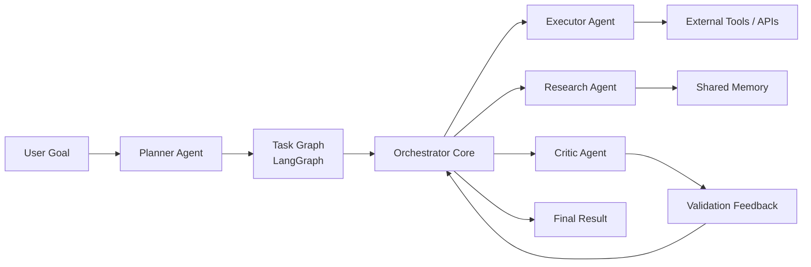
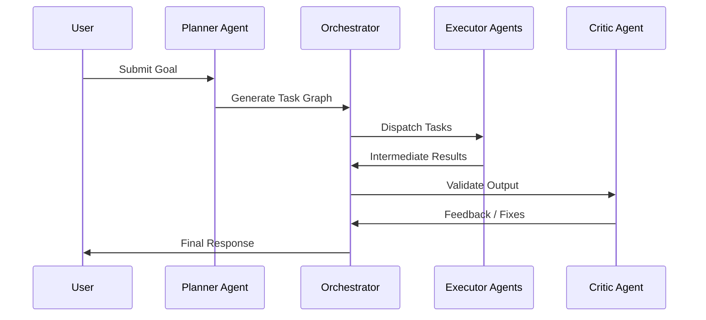

# 🤖 Agentic AI Orchestrator

A **production-grade multi-agent AI orchestration framework** for autonomous task planning, execution, collaboration, and monitoring.  
The system integrates **LangGraph**, **LangChain**, **CrewAI**, and **AutoGen** to enable **scalable, AI-driven decision-making pipelines** using graph-based workflows and role-aware agents.

---

## 🚀 Overview

**Agentic AI Orchestrator** coordinates multiple autonomous AI agents to decompose high-level goals, execute tasks in parallel, validate outcomes, and iteratively refine results.  
Instead of linear prompt chains, the system uses **stateful graphs** and **agent collaboration** to deliver reliability, scalability, and observability.

---

## 🧠 Core Capabilities

- Multi-agent task planning and delegation  
- Graph-based workflow orchestration (LangGraph)  
- Tool-augmented reasoning and memory (LangChain)  
- Role-based agent collaboration (CrewAI)  
- Autonomous agent conversations and execution (AutoGen)  
- Built-in feedback loops for validation and correction  
- Centralized monitoring of agent states and outputs  

---

## 🏗️ System Architecture



## 🧩 Agent Roles

| Agent | Responsibility |
|------|----------------|
| **Planner Agent** | Converts high-level goals into structured task graphs |
| **Executor Agents** | Perform domain-specific actions (code, research, reasoning) |
| **Critic Agent** | Validates outputs, enforces constraints, and detects errors |
| **Observer Agent** | Monitors execution, logs states, metrics, and failures |

---

## 🔄 Workflow Lifecycle


## ⚙️ Technology Stack

- **LangGraph** — Stateful, graph-based agent workflows for dynamic task routing  
- **LangChain** — Tool abstraction, memory management, and prompt orchestration  
- **CrewAI** — Role-based multi-agent collaboration and coordination  
- **AutoGen** — Autonomous agent communication and execution loops  
- **Python** — Core orchestration logic and system glue  

---
## 🔍 Monitoring & Observability

- Per-agent execution state tracking and lifecycle visibility  
- Structured, queryable logs for decisions, errors, and failures  
- Feedback-driven retries, self-correction, and recovery loops  
- End-to-end execution timelines and outcome auditing  

---

## 🧪 Example Use Cases

- Autonomous research, synthesis, and report generation  
- Multi-step coding, testing, and debugging pipelines  
- AI-driven business and operational decision systems  
- Tool-augmented reasoning and analysis workflows  
- Complex task automation with human-in-the-loop oversight  

---

## 🛠️ Quick Start

```bash
git clone https://github.com/your-username/agentic-ai-orchestrator
cd agentic-ai-orchestrator
pip install -r requirements.txt
python main.py
```

## 📈 Design Principles

- Agents over prompts 
- Multi-step coding, testing, and debugging pipelines  
- Graphs over chains 
- Feedback over blind execution 
- Scalability by design
